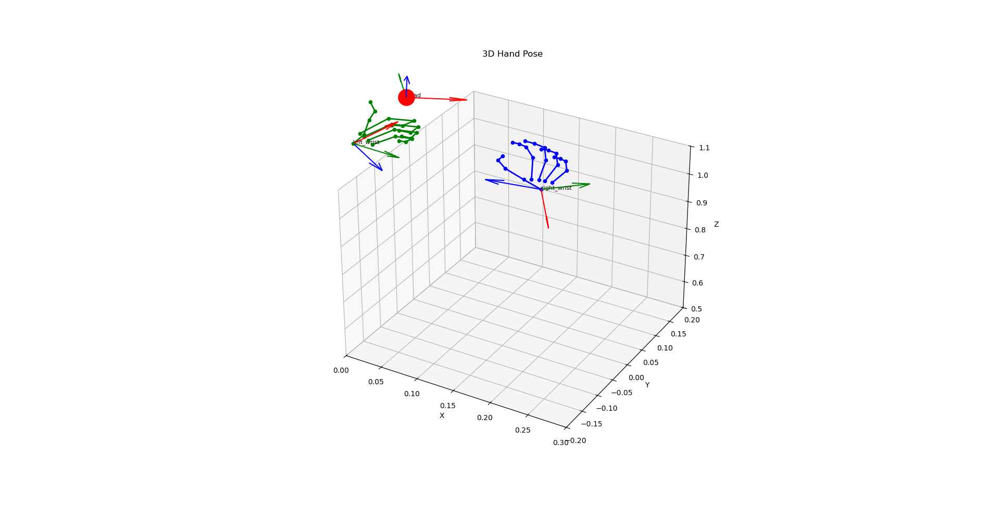

# Apple Vision Pro Hand Pose Utilities

A Python toolkit for streaming and visualizing **3D hand** and **head poses** from Apple Vision Pro using `VisionProStreamer` and `Matplotlib`.


## Features

* Convert raw 4×4 pose matrices into PyTorch tensors

* Real-time 3D visualization of wrists, fingers, and head poses

* Customizable rendering options: labels, colors, and connectivity

* Skip or customize bone connections for flexible visualization

## Installation

```bash
# Clone the repository
git clone https://github.com/AISL-Sejong-Organization/Apple-Vision-Pro-Utils.git
cd Apple-Vision-Pro-Utils

# (Optional) Create a virtual environment
python -m venv venv
source venv/bin/activate

pip install avp_stream torch
```

## Usage

Run the code with ip address to start streaming, visualizing, saving hand poses :

```bash
python visualize_handpose.py --ip <VISION_PRO_IP> [--record] [--follow] [--save_dir]
```

Run the code with file path to start visualizing saved hand poses :

```bash
python visualize_handpose.py --load <SEQUENCE_FILE_PATH>
```

### Arguments:

* `--ip`: IP address of the Apple Vision Pro device or streamer

* `--record`: Enable recording of the incoming stream

* `--follow`: Automatically adjust the view to follow the hand movement

* `--save_dir`: Set the directory to save npz file. Default is 'data/'

* `--load`: The path of saved npz file.

# Figure 1. 3D hand & head pose visualization(handpose.py)

